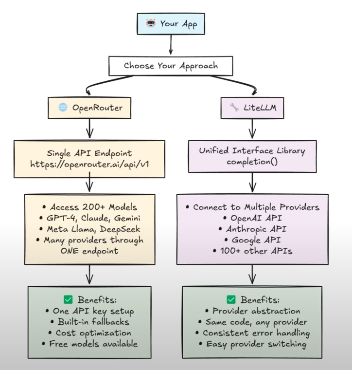

# Exploring Different Approaches to Using LLMs in Python

This repository demonstrates two different approaches to integrating Large Language Models (LLMs) in Python applications using OpenRouter and LiteLLM.



## Table of Contents
- [Overview](#overview)
- [Prerequisites](#prerequisites)
- [OpenRouter Implementation](#openrouter-implementation)
- [LiteLLM Implementation](#litellm-implementation)
- [Setup and Configuration](#setup-and-configuration)
- [Usage](#usage)

## Overview

This project showcases two different methods of interacting with various LLM providers:
1. Using OpenRouter as a unified API gateway
2. Using LiteLLM as a unified interface

Each approach has its own advantages and use cases, which are detailed below.

## Prerequisites

- Python 3.8 or higher
- An OpenRouter API key (get from [OpenRouter](https://openrouter.ai/settings/keys))
- A Google API key (for Gemini access in LiteLLM example)
- Required Python packages:
  ```
  openai
  python-dotenv
  litellm
  ```

## OpenRouter Implementation

OpenRouter provides a unified API gateway to access multiple AI models through a single endpoint. Below are the terminal outputs of the file `try_openrouter.py`.


### Features
- Uses OpenAI's client library with a custom base URL
- Supports multiple models through a single API
- Pay-as-you-go pricing model
- Simple integration with existing OpenAI-style code


### Code Example (`try_openrouter.py`)
```python
from openai import OpenAI
client = OpenAI(
    base_url="https://openrouter.ai/api/v1",
    api_key="your_openrouter_api_key",
)
```

## LiteLLM Implementation

LiteLLM provides a unified interface for multiple LLM providers with consistent response formats. Below is the output of the file `try_litellm.py`.


### Features
- Single interface for multiple providers
- Consistent response format
- Built-in support for many models
- Simple error handling
- Optional caching and logging

### Code Example (`try_litellm.py`)
```python
from litellm import completion
response = completion(
    model="gemini/gemini-1.5-flash",
    api_key=gemini_api_key,
    messages=[{"role": "user", "content": "Hello!"}]
)
```

## Setup and Configuration

1. Clone this repository
2. Create a `.env` file in the root directory with your API keys:
   ```env
   OPENROUTER_API_KEY=your_openrouter_api_key
   GOOGLE_API_KEY=your_google_api_key
   ```
3. Install UV (Fast Python Package Installer):
   ```powershell
   pip install uv
   ```

4. Install required packages using UV:
   ```powershell
   uv pip install openai python-dotenv litellm
   ```

## Usage

### Running OpenRouter Example
```powershell
uv run try_openrouter.py
```

### Running LiteLLM Example
```powershell
uv run try_litellm.py
```

### Why UV?
This project uses UV, a fast Python package installer and resolver written in Rust. UV offers several advantages:
- Up to 10-100x faster than pip
- Built-in dependency resolver
- Automatic environment management
- Reproducible installations with lockfile support
- Compatible with existing Python tools

Both scripts will prompt for input and demonstrate interaction with different LLM providers through their respective interfaces.

## Note on API Keys

- Never commit your API keys to version control
- Always use environment variables or secure key management
- Keep your API keys confidential and rotate them regularly
- Monitor your API usage to control costs